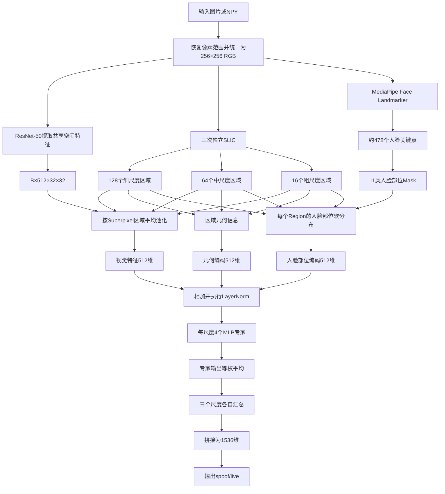

# FAS Superpixel-MoE 项目完整说明

> 整理日期：2026年8月17日  
> 项目路径：`F:\moe\superpixel_moe_upload`

## 一、项目整体在做什么

这个项目用于人脸活体检测，也就是判断输入人脸是真人还是攻击样本。模型标签固定为：

```text
spoof = 0
live  = 1
```

它和普通整图分类模型的区别是：模型不会只把整张脸压缩成一个全局特征，而是先用 Superpixel 将人脸划分成多个不规则区域，再判断每个区域对应眼睛、鼻子、嘴、脸颊、额头还是下巴，最后让多个专家分别处理这些区域特征。

完整数据流如下：



具体来说，程序先通过 `fas_moe/io.py` 读取 JPG、PNG、BMP、TIFF 或 NPY。NPY 可以是 HWC、CHW、NHWC 或 NCHW 格式，也可以处于 `[0,1/255]`、`[0,1]`、`[0,255]` 或 `uint16` 等范围。所有输入最终都被转换为：

```text
形状：256×256×3
通道顺序：RGB
类型：uint8
数值范围：[0,255]
```

其中 `[0,1/255]` 是项目原有部分 FAS 数据的特殊格式，因为图像可能被连续除以两次 255，恢复时需要乘以 $255^2$。普通 `[0,1]` 图像只需要乘以 255。对于 `uint16`，程序会按照数据类型最大值缩放到 `[0,255]`。

目前输入模块只负责格式和尺寸统一，不会自动进行人脸检测、裁剪和对齐。因此项目默认输入本身已经是裁剪较好的人脸。如果输入包含大量背景，Superpixel 也会对背景进行分割，可能影响结果。

## 二、Superpixel、Landmark 和 MoE 具体是怎样实现的

Superpixel 主要由 `fas_moe/segmentation.py` 实现，当前使用的是 `scikit-image` 中的标准 SLIC，不是 ISEC。

同一张 256×256 图像会独立运行三次 SLIC：

```text
原图 → 128个区域
原图 → 64个区域
原图 → 16个区域
```

128 个区域负责观察较细的纹理，例如眼睛周围、嘴部边缘、打印颗粒、屏幕摩尔纹和面具接缝；64 个区域负责观察鼻子、脸颊、额头等中等范围部位；16 个区域负责观察整体肤色、反光和全局材质。

这三个尺度并不是由 128 逐层合并成 64 和 16，而是三次独立分割。因此当前没有父子 Region 关系，也没有跨尺度区域映射。

SLIC 默认参数为：

```text
compactness = 10
sigma = 1
max_num_iter = 10
enforce_connectivity = True
min_size_factor = 0.25
max_size_factor = 3.0
```

标准 SLIC 请求 128 个区域时，不一定正好输出 128 个连通区域。代码为此增加了“重试与合并”机制。如果实际区域少于目标，就提高 SLIC 请求数量并重试；如果多于目标，就只在相邻区域之间合并。合并优先选择颜色和面积比较接近的区域：

$$
cost=0.9\times Lab颜色距离+0.1\times 相对面积差
$$

因此最终能够稳定得到精确的 128、64、16 个连通区域。

每个尺度会生成五类信息。第一类是 `labels`，形状为 `[256,256]`，保存每个像素所属的区域编号；第二类是 19 维手工特征；第三类是区域邻接边；第四类是 5 维几何位置；第五类是 11 维 Landmark 部位分布。

19 维手工特征由 `fas_moe/features.py` 计算，包括 RGB 均值和标准差 6 维、Lab 均值和标准差 6 维、梯度均值和标准差 2 维、面积比例、中心位置、周长比例和紧致度 5 维。这些特征目前会被计算、缓存和导出，但尚未输入分类模型。区域邻接边同样会被生成，每条边表示两个 Superpixel 共享边界，但当前没有图神经网络，因此邻接边也没有参与分类。

真正进入模型的是区域标签、5 维几何位置和 Landmark 部位分布。5 维几何位置为：

```text
区域中心X
区域中心Y
区域面积比例
包围框宽度比例
包围框高度比例
```

它们经过：

```text
Linear(5→128)
GELU
Linear(128→512)
```

变成 512 维位置编码。

Landmark 部分由 `fas_moe/landmarks.py` 和 `fas_moe/face_parts.py` 完成。项目调用现成的 Google MediaPipe Face Landmarker，通常输出约 478 个人脸关键点，坐标归一化到 `[0,1]`。

项目没有直接把 478 个关键点坐标输入分类器，而是将关键点转换为 11 类互斥的人脸部位：

```text
unknown
left_eyebrow
right_eyebrow
left_eye
right_eye
nose
mouth
left_cheek
right_cheek
forehead
chin
```

程序先用脸部轮廓关键点填充完整 Face Oval，再根据眉毛高度确定额头，根据嘴和下巴的位置确定下巴，以鼻子中心划分左右脸颊，最后用多边形覆盖眉毛、眼睛、鼻子和嘴。人脸外部全部属于 `unknown`。代码采用人物自身的左右方向，所以人物左眼在正面图像中通常出现在画面右侧。

得到 11 类人脸部位 Mask 后，程序计算每个 Superpixel 和每个人脸部位的重叠比例：

$$
r_{k,p}=\frac{|S_k\cap M_p|}{|S_k|}
$$

其中 $S_k$ 是第 $k$ 个 Superpixel，$M_p$ 是第 $p$ 个人脸部位。例如，一个 Superpixel 可能同时覆盖：

```text
左眼：60%
左脸颊：30%
背景：10%
```

它不会被强制标记成单一的“左眼”，而是保留完整的 11 维软分布：

```text
left_eye   = 0.60
left_cheek = 0.30
unknown    = 0.10
```

三个尺度分别得到：

```text
128尺度：[128,11]
64尺度： [64,11]
16尺度： [16,11]
```

每行概率和都等于 1。然后模型使用一个可学习的 `nn.Embedding(11,512)`，将 11 维分布转换成 512 维人脸部位编码：

$$
e_k^{part}=r_kE
$$

也就是使用各部位概率对 11 个 Embedding 加权求和。这样一个跨越左眼和左脸颊的 Region，会同时具有左眼和脸颊语义。

如果 Landmark 模型缺失、MediaPipe 不可用、图片中检测不到人脸或者返回的关键点无效，程序不会中断，而是把所有 Region 设置为：

```text
unknown = 1
其他部位 = 0
```

这时模型仍然可以使用 ResNet 视觉特征和几何位置继续运行。

视觉特征由 `fas_moe/backbone.py` 中的 ResNet-50 提取。项目只保留：

```text
conv1
bn1
relu
maxpool
layer1
layer2
```

所以输入 `[B,3,256,256]` 后，得到 `[B,512,32,32]`。项目没有使用 ResNet 后面的 layer3、layer4、全局池化和 ImageNet 分类头。这样做是为了保留较高分辨率的空间纹理。三个 Superpixel 尺度共享这张特征图，所以一个 batch 只运行一次 Backbone。

SLIC 标签原本是 256×256，而 Backbone 特征只有 32×32。程序使用最近邻插值把标签缩小到 32×32，然后把属于同一 Region 的 512 维特征求平均：

$$
z_k=\frac{1}{|S_k|}\sum_{(x,y)\in S_k}F(x,y)
$$

得到：

```text
128尺度：[128,512]
64尺度： [64,512]
16尺度： [16,512]
```

如果某个很小的 Superpixel 在缩小到 32×32 后完全消失，程序会使用该 Region 质心位置的特征作为回退，保证每个区域都有有效特征。

最终每个 Region Token 由三部分相加：

$$
Token_k=LayerNorm\left(Visual_k+Geometry_k+FacePart_k\right)
$$

即：

```text
ResNet区域视觉特征512维
+ 区域几何位置编码512维
+ Landmark人脸部位编码512维
→ LayerNorm
```

当前没有加入设计文档中提到的尺度 Embedding、Landmark 置信度权重或几何/部位可学习融合权重。

经过 Token 构造后，128、64、16 三个尺度分别进入独立的专家模块。每个尺度有 4 个专家，总共 12 个专家。每个专家结构为：

```text
LayerNorm(512)
Linear(512→256)
GELU
Linear(256→512)
```

同一个 Token 会经过全部 4 个专家，最后直接平均：

$$
Y=\frac{Expert_1(T)+Expert_2(T)+Expert_3(T)+Expert_4(T)}{4}
$$

因此当前模型虽然命名为 MoE，但还没有真正的 Router、Top-k、专家选择和负载均衡。它更接近“四个 MLP 专家的等权集成”。

每个尺度经过专家后，再对所有 Region 等权平均：

```text
[B,128,512] → [B,512]
[B,64,512]  → [B,512]
[B,16,512]  → [B,512]
```

三个 512 维尺度向量拼接为 1536 维，最后经过 `LayerNorm(1536)` 和 `Linear(1536→2)`，输出 spoof 和 live 两个 logits。

## 三、训练、推理、缓存和 Checkpoint

训练入口是 `train_moe.py`，目前直接支持：

```text
CASIA-FASD
Idiap Replay-Attack
MSU-MFSD
OULU-NPU
```

数据目录要求类似：

```text
dataset_root/
└── domain-generalization/
    └── CASIA-FASD/
        ├── casia_images_live.npy
        └── casia_images_spoof.npy
```

数据使用内存映射读取，不会一次性将整个 NPY 载入内存。标签固定为 `live=1`、`spoof=0`。训练使用 `WeightedRandomSampler`，按照类别数量的倒数分配采样权重，缓解真人和攻击样本数量不平衡。

2026年8月17日的检查发现并修复了 `--limit-samples` 的问题。原来数据逻辑顺序是所有 live 在前、所有 spoof 在后，所以直接限制前 20 张会得到 20 张 live、0 张 spoof。现在修改为优先平衡两类：

```text
--limit-samples 20
→ 10张live
→ 10张spoof
```

如果限制为奇数，例如 5，会得到 3 张 live 和 2 张 spoof；如果一个类别数量不足，再由另一个类别补足。对应修复位于 `train_moe.py`，新增回归测试位于 `tests/test_checkpoint_data.py`。

训练默认配置为：

```text
batch_size = 2
epochs = 1
max_steps = 1
learning_rate = 1e-4
optimizer = AdamW
loss = CrossEntropyLoss
seed = 7
backbone = 默认冻结
```

默认只运行一个 step，是为了先验证数据、梯度和 Checkpoint 链路，避免误启动长时间训练。训练结束后保存：

```text
checkpoint.pt
history.json
config.json
```

推理入口是 `run_moe.py`。它先生成 Superpixel 和 Landmark 信息，再调用模型，最后导出：

```text
input.png
labels_*.npy
features_*.npy
edges_*.npy
positions_*.npy
part_distribution_*.npy
tokens_*.npy
summary.json
```

`summary.json` 中保存输入范围、SLIC 参数、区域数量、缓存状态、Landmark 状态、Checkpoint 验证、logits、概率、设备和前向耗时。

SLIC 和 Landmark 都具有缓存。SLIC 缓存保存标签、19 维特征、邻接边和 5 维位置；Landmark 缓存保存关键点、检测状态、失败原因以及三个尺度的部位软分布。缓存键不仅包含图像内容，还包含 SLIC 参数、尺度、Landmark 模型身份和检测阈值。

缓存读取时会验证形状、类型、标签连续性、数值范围、概率和、邻接关系等内容。发现缓存损坏后，不会直接报错，而是重新计算并修复。缓存写入使用临时文件和原子替换，减少程序中断造成的半文件问题。

Checkpoint 由 `fas_moe/checkpoint.py` 严格验证。加载前会比较参数名称、参数形状以及以下结构配置：

```text
levels
feature_channels
position_dim
expert_hidden_dim
num_experts
num_classes
use_landmarks
image_range
```

例如旧 Checkpoint 没有 Landmark，而当前模型启用 Landmark，即使部分参数形状相同，也会拒绝加载，避免产生表面正常但实际错误的结果。

## 四、项目文件及职责

| 文件 | 主要职责 |
|---|---|
| `.gitignore` | 排除数据集、缓存、模型权重、Checkpoint、虚拟环境和临时文件。 |
| `requirements.txt` | 保存项目依赖和版本约束。 |
| `run_moe.py` | 单图或 NPY 推理，导出中间结果和分类结果。 |
| `train_moe.py` | 读取训练数据，执行采样、前向、反向、参数更新和 Checkpoint 保存。 |
| `cache_landmarks.py` | 训练前批量生成 Landmark 部位分布及相关缓存。 |
| `fas_moe/__init__.py` | 汇总并公开项目 Python API。 |
| `fas_moe/io.py` | 输入读取、通道转换、数值范围恢复和图像缩放。 |
| `fas_moe/features.py` | 计算每个 Superpixel 的 19 维手工特征。 |
| `fas_moe/segmentation.py` | 三尺度 SLIC、区域数修正、邻接图、位置、特征和缓存。 |
| `fas_moe/landmarks.py` | 封装 MediaPipe，负责模型路径、关键点检测和失败回退。 |
| `fas_moe/face_parts.py` | 将关键点转换成 11 类人脸部位并计算 Region 软分布。 |
| `fas_moe/backbone.py` | 构建截断到 layer2 的共享 ResNet-50。 |
| `fas_moe/model.py` | Region Pooling、位置编码、部位编码、专家模块和分类头。 |
| `fas_moe/checkpoint.py` | 严格校验和加载模型 Checkpoint。 |
| `tests/test_moe_pipeline.py` | 测试 SLIC、Landmark、池化、MoE和模型前后向。 |
| `tests/test_checkpoint_data.py` | 测试输入范围、缓存、Checkpoint和限量类别平衡。 |
| `README.md` | 项目主说明。 |
| `RUN_GUIDE_CN.md` | 面向组员的 Windows 安装和运行指南。 |
| `CODE_WALKTHROUGH_MOE.md` | 按数据流解释代码。 |
| `LANDMARK_FACE_PART_ENCODING_PLAN.md` | Landmark 部位编码的设计、公式和消融方案。 |
| `WINDOWS_DATASET_TEST_RESULTS.md` | 历史 Windows 数据兼容性测试报告。 |

## 五、当前测试情况和实际完成度

2026年8月17日，使用 NVIDIA GeForce RTX 4060 Laptop GPU 和真实 MediaPipe 模型重新进行了完整验证，结果为：

```text
19项单元测试全部通过
Python源码编译通过
pip依赖完整性检查通过
真实Landmark检测通过
真实GPU推理通过
SLIC首次计算通过
SLIC缓存命中通过
Landmark首次检测通过
Landmark缓存命中通过
真实CASIA一步训练通过
Checkpoint保存通过
Checkpoint严格回载通过
加载Checkpoint后推理通过
修复后的20样本均衡训练通过
```

真实推理产生的数据形状全部正确：

```text
labels：
[256,256]

features：
[128,19]
[64,19]
[16,19]

positions：
[128,5]
[64,5]
[16,5]

part_distribution：
[128,11]
[64,11]
[16,11]

tokens：
[128,512]
[64,512]
[16,512]
```

所有数组均为有限值，部位软分布每行和为 1。真实训练完成一个 batch、一个 step，Checkpoint 包含 233 项模型状态，并成功严格回载。

不过这些测试只能证明工程链路正常，不能证明模型已经具备有效的活体检测能力。当前仍然没有正式的训练集、验证集和测试集划分，也没有 Accuracy、APCER、BPCER、ACER、HTER、AUC 和 EER 结果。一步训练或未训练分类头输出的概率没有实际研究意义。

当前真正进入分类模型的是：

```text
ResNet区域特征
5维几何位置
Landmark部位软分布
Landmark Embedding
三尺度等权专家
```

已经生成但没有进入模型的是：

```text
19维手工特征
Superpixel邻接边
原始478个Landmark坐标
```

尚未实现的是：

```text
ISEC
层级Superpixel
父子Region关系
图神经网络
Region Attention
Scale Attention
Scale Embedding
真正的Router
Top-k专家
负载均衡损失
Landmark置信度门控
人脸自动检测和对齐
正式数据增强
正式FAS评估协议
```

## 六、最终总结

当前项目的本质是把一张人脸转换成多个带有视觉、位置和语义信息的 Region Token。

视觉信息来自：

```text
ResNet-50空间特征图
→ 按Superpixel平均池化
```

位置信息来自：

```text
区域中心
区域面积
区域包围框
```

语义信息来自：

```text
MediaPipe关键点
→ 11类人脸部位
→ Superpixel与部位的重叠比例
→ 可学习Part Embedding
```

最终每个 Region 表达为：

$$
\boxed{
Token_k=LayerNorm\left(Visual_k+Geometry_k+FacePart_k\right)
}
$$

128、64、16 三个尺度分别处理不同范围的人脸攻击线索，每个尺度由 4 个 MLP 专家等权处理，最后将三个尺度的 512 维特征拼接成 1536 维并进行真人/攻击分类。

因此当前项目最准确的定义是：

> 一个已经完成三尺度 SLIC、MediaPipe 人脸部位软编码、共享 ResNet 区域池化、几何位置编码、等权多专家、训练推理、缓存和严格 Checkpoint 验证的可运行 FAS 研究基线。

它目前已经从“只能测试结构”发展到了“能够使用真实图片、真实 Landmark 模型和真实 FAS 数据完成训练与推理”，但还没有发展到“经过正式协议训练并拥有可信 FAS 指标”的阶段。

下一步最重要的工作是先完成正式训练和评估，分别比较：

```text
无Landmark
有Landmark
随机Landmark
等权专家
Soft Router
Top-k Router
SLIC
ISEC
```

只有得到 ACER、HTER、AUC 等正式指标，才能真正判断 Superpixel、Face Landmark 和 MoE 分别带来了多少性能提升。
